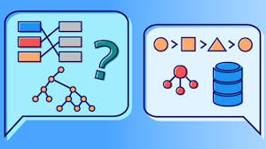

# Estructura de Datos Aplicadas

En este **repositorio** se encuentra información de Estructura de Datos en Java, javaScript y Python

1. Conceptos básicos
1. Arreglos
1. Listas enlazadas 
1. Pilas y colas
1. Árboles binarios
***

**Jaime Aldair Andrade Rojo**